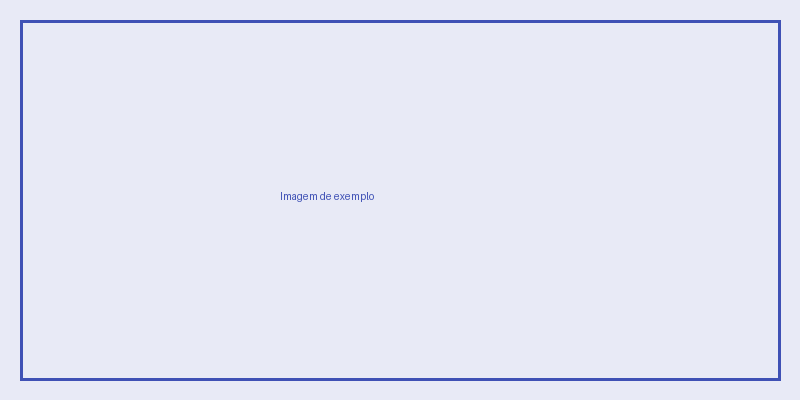

# Primeiros Passos

Este guia mostra como preparar o ambiente para começar a trabalhar no projeto.

## Pré-requisitos

- [ ] Acesso ao repositório
- [ ] Ferramentas instaladas (liste aqui as ferramentas do seu projeto)
- [ ] Variáveis de ambiente configuradas

## Passo a passo

1. Clone o repositório
2. Instale as dependências
3. Configure o ambiente
4. Rode o projeto localmente

## Como inserir imagens (exemplo)

Todas as imagens ficam na pasta `docs/assets/imagens/`. Para usá-las em qualquer
página, basta referenciar assim:

```markdown

```

Exemplo real (substitua pelo seu print/diagrama):



!!! info "Boa prática"
    Dê nomes descritivos aos arquivos de imagem (ex: `fluxo-login.png`, não `imagem1.png`).
    Isso evita bagunça conforme a documentação cresce.
